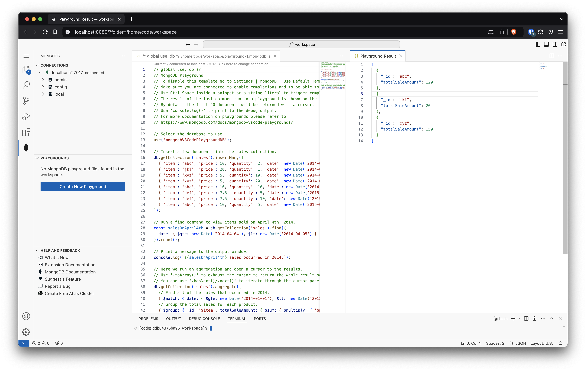

# A complete development environment for MongoDB

_Note: this is an experiment I built for fun in the weekend. It's not a MongoDB product and it is not supported by MongoDB in any way._



This repo contains the code to built a Docker image with [MongoDB Atlas Local](https://hub.docker.com/r/mongodb/mongodb-atlas-local/) and a VS Code Server for development, including [MongoDB for VS Code](https://marketplace.visualstudio.com/items?itemName=mongodb.mongodb-vscode).

Run

```
$ docker build -t mongodb-dev-env .
$ docker run -p 8080:8080 mongodb-dev-env:latest  
```

and open your browser at [http://localhost:8080](http://localhost:8080) and start coding.

### Known issue
* For some reason, Ctrl-C does not seem to terminate the container properly
* The MongoDB for VS Code does not automatically connect to the local MongoDB because it's not something the extension currently support. However, once you've connected once, the connection is preserved in local storage.